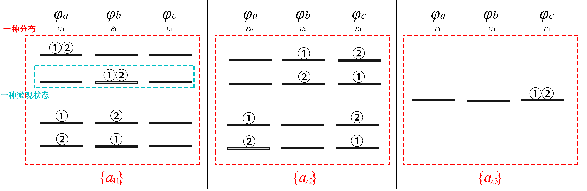

# 配分函数：从微观粒子到宏观统计
> 参考书籍：
>
> 《热力学与统计物理学（第二版）》，林宗涵，北京大学出版社

- Maxwell－Boltzmann分布的得出？
- 神奇的**配分函数**是什么，有何作用？
- 怎样建立起微观粒子到宏观统计量的桥梁？

## 1. 微观粒子的量子描述

系统中的每个微观粒子（子系）的状态可以使用**量子描写**：

- 每个子系的状态可以用一组**量子数（量子态/微观状态）**表示。粒子的量子态包括粒子的**内禀性质**（如质量、自旋、电荷）和**运动状态**（即运动**轨道**）。内禀性质完全相同的粒子称为**全同粒子**

  玻色子：自旋为$\hbar$的整数倍的粒子，或由偶数个费米子构成/由玻色子构成的复合粒子。不受泡利不相容原理制约

  费米子：自旋为$\frac{\hbar}{2}$的奇数倍的粒子，或由奇数个费米子构成的复合粒子。全同的费米子不能处于同一运动轨道，即**单一量子态仅能包含最多一个费米子**（泡利不相容原理）

- 粒子能量本征值是为量子化的（即能级 $\varepsilon$ ）。每一个能级 $\varepsilon_{i}$ 上的<u>量子态</u>数称为简并度 $g_{i}$

- **全同性原理**：（一般情况下）全同粒子是不可分辨的（即交换全同粒子，系统的量子态不改变）。其本质为粒子的运动轨道具有不确定性，且不确定性随时间演化而增加；若两个全同粒子的运动轨道在空间中的概率分布具有“重叠”，此时两粒子均有可能处于相同的量子态，即不可分辨

  **定域子系**：若全同粒子的波函数均被**约束**在固定区域（如独立原子中的电子），或**粒子间距足够大**（如理想气体），使得粒子间波函数无法重叠（实际上是重叠的概率极小），此时系统称为定域子系。显然，定域子系中的全同粒子是可以区分的（因为它们不可能在空间中处于同一运动轨道，也不可能具有完全相同的量子态）

对于由2个全同粒子 $①,②$ ，3个轨道（即系统量子态） $\varphi_{a},\varphi_{b},\varphi_{c}$ 的系统，其所包含的可能微观量子态即有以下可能：

对于定域费米子而言，可以发现两个全同费米子允许处于同一轨道上：从单个粒子的角度而言，两个粒子的轨道是相同的；但在空间中，两个轨道（几乎）不可能重叠，因此两者依然具有不同的量子态（就如同两个全同电子分别处于两个独立原子的 $2p_{z}$ 轨道中一样并无不妥。对于电子而言，它们所处的轨道是”相同的“——当然它们也不会知道另一个电子的存在）

## 2. **等几率原理**

<u>平衡态</u>统计物理的<u>基本假设</u>（不可证明，但有丰富的实验支持）

<b style="color:red;font-size:25px">平衡态下的孤立系中，各个可能的微观状态（量子态）出现几率相等</b>

平衡态+孤立系：系统的总能量 $E$ ，系统体积 $V$ ，系统粒子数 $N$ 均不变

## 3. 近独立子系分布

### 近独立子系

- 粒子（子系）间没有相互作用，因此体系总能量为粒子总能量的简单加和；
- 但允许粒子间有能量交换，从而保证系统能够达到平衡态

### 分布

对于由低到高的能级排列 $\varepsilon_{\lambda}$ ，每个能级简并度为 $g_{\lambda}$ ，每个能级占据粒子数为 $a_{\lambda}$ ，该种状态称为分布 $\{a_{\lambda}\}$ 

一种分布 $\{a_{\lambda}\}$ 中包含有多种微观状态，包含的微观状态数记为 $W(\{a_{\lambda}\})$；根据等几率原理，分布 $\{a_{\lambda}\}$ 包含的微观状态数越多，出现几率越大，且两者成正比，即：
$$
P(\{a_{\lambda}\})\propto W(\{a_{\lambda}\})
$$
考虑**平衡态+孤立系**的前提，对总粒子数 $N$ 和总能量 $E$ （满足近独立子系假设）应具有如下限制：
$$
\sum_{\lambda}{a_{\lambda}}=N \\
\sum_{\lambda}{\varepsilon_{\lambda}a_{\lambda}}=E
$$

下图以2个全同粒子 $①,②$ ，3个轨道 $\varphi_{a},\varphi_{b},\varphi_{c}$ 构成的定域子系系统，阐明分布 $\{a_{\lambda}\}$ 与微观状态的概念：

若规定：$\varphi_{a},\varphi_{b}$ 具有相同的能级 $\varepsilon_{0}$  ，$\varphi_{c}$ 能级为  $\varepsilon_{1}$，且 $\varepsilon_{1} >\varepsilon_{0}$ ，则有

其中蓝框框选的为一种微观状态（量子态）；每个红框分布对应一种分布——根据分布的定义，使分布在各能级中的粒子数相同的所有量子态的集合组成为一个分布；

即该系统的所有可能分布为：

- $\{a_{\lambda 1}\}$，代表：能级 $\varepsilon_{0}$ 下 $a_{0}=2$ ，能级 $\varepsilon_{1}$ 下 $a_{1}=0$ 的所有可能量子态集合
- $\{a_{\lambda 2}\}$，代表：能级 $\varepsilon_{0}$ 下 $a_{0}=1$ ，能级 $\varepsilon_{1}$ 下 $a_{1}=1$ 的所有可能量子态集合
- $\{a_{\lambda 3}\}$，代表：能级 $\varepsilon_{0}$ 下 $a_{0}=0$ ，能级 $\varepsilon_{1}$ 下 $a_{1}=2$ 的所有可能量子态集合

三种分布均满足对于 $N$ 和 $E$ 的约束条件；

根据等几率原理，显然有：
$$
P(\{a_{\lambda 1}\}):P(\{a_{\lambda 2}\}):P(\{a_{\lambda 3}\})
=W(\{a_{\lambda 1}\}):W(\{a_{\lambda 2}\}):W(\{a_{\lambda 3}\})
=4:4:1
$$

## 4. *Maxwell－Boltzmann*分布

### 最可几分布（most probable distribution）

- 系统所有可能分布中，出现几率最大的分布称为**最可几分布**（记作$\{\tilde{a}_{\lambda}\}$）

- 本质上是求包含量子态数目 $W\{a_{\lambda}\}$ 最多的分布 $\{a_{\lambda}\}$，即$\{\tilde{a}_{\lambda}\}$为满足以下条件的分布：
  $$
  \delta \ln W(\{a_{\lambda}\})=0\\
  \delta^2 \ln W(\{a_{\lambda}\})\lt 0
  $$
  考虑到总能量、总粒子数均应不变，还需要有约束条件：
  $$
  \delta N=0 \\
  \delta E=0
  $$

### 定域子系最可几分布——*Maxwell－Boltzmann*分布

首先需要表示出定域子系下，任意分布 $\{a_{\lambda}\}$对应的量子态数目 $W\{a_{\lambda}\}$ ：
$$
W\{a_{\lambda}\} =\frac{N!}{\prod \limits_{\lambda}{a_{\lambda}!}}\prod_{\lambda}{g_{\lambda}^{a_{\lambda}}}
$$
其中， $g_{\lambda}^{a_{\lambda}}$ 代表在能级 $\varepsilon_{\lambda}$ 中，$a_{\lambda}$ 个粒子填充进入 $g_{\lambda}$ 个简并轨道的组合数；各能级组合数累乘得到所有粒子在所有能级排列的可能状态数；由于定域粒子可分辨，因此需要考虑不同能级间粒子的交换组合数，即 $\frac{N!}{\prod \limits_{\lambda}{a_{\lambda}!}}\prod_{\lambda}$

使用Lagrange乘数法求 $\ln W(\{a_{\lambda}\})$的极大值条件：由于具有关于 $N, E$ 的约束条件，因此引入2个乘子$\alpha,\beta$，表示如下：
$$
\delta \ln W(\{a_{\lambda}\})-\alpha \delta N - \beta \delta E=0
$$
展开为：
$$
-\sum_{\lambda}(\ln \frac{a_{\lambda}}{g_{\lambda}}+\alpha+\beta \varepsilon_{\lambda})\delta a_{\lambda}=0
$$
使上式满足的 $\tilde{a}_{\lambda}$ ，即对应于该系的最可几分布$\{\tilde{a}_{\lambda}\}$。易得：
$$
\tilde{a}_{\lambda}=g_\lambda e^{-\alpha-\beta\varepsilon_{\lambda}}
$$
同样易证该取值下，$\delta^2 \ln W(\{a_{\lambda}\})\lt 0$

对于理想气体等系统，常将其视作定域子系，因此其分子的最可几分布（实际上也是平均分布）亦满足 $\tilde{a}_{\lambda}=g_\lambda e^{-\alpha-\beta\varepsilon_{\lambda}}$ 。该公式即为***Maxwell－Boltzmann*分布（MB分布）**

现在讨论上文中以2个全同粒子 $①,②$ ，3个轨道 $\varphi_{a},\varphi_{b},\varphi_{c}$ 构成的定域子系系统（$\varphi_{a},\varphi_{b}$ 具有相同的能级 $\varepsilon_{0}$  ，$\varphi_{c}$ 能级为  $\varepsilon_{1}$）

能级 $\varepsilon_{0}$ 的简并度$g_{0}=2$；能级 $\varepsilon_{1}$ 的简并度$g_{1}=1$；因此最可几分布下，各能级上出现的粒子数$\tilde{a}_{\lambda}$之比为：
$$
\frac{\tilde{a}_{1}}{\tilde{a}_{0}}=
\frac{g_1 e^{-\alpha-\beta\varepsilon_{1}}}{g_0 e^{-\alpha-\beta\varepsilon_{0}}}=
\frac{g_1}{g_0}\cdot e^{-\beta(\varepsilon_{1}-\varepsilon_{0})}
$$
由于 $\varepsilon_{1} >\varepsilon_{0}$ ，易得$\frac{\tilde{a}_{1}}{\tilde{a}_{0}}<1$。考虑到该系统所有可能出现的分布只有三种情况，因此在题设条件下可知该系统的最可几分布为

- $\{\tilde{a}_{\lambda 1}\}=\{a_{\lambda 1}\}$：能级 $\varepsilon_{0}$ 下 $\tilde{a}_{0}=2$ ，能级 $\varepsilon_{1}$ 下 $\tilde{a}_{1}=0$ 

实际上，该系统$P(\{a_{\lambda 1}\}):P(\{a_{\lambda 2}\}):P(\{a_{\lambda 3}\})=4:4:1$，这是由于粒子数目太少而表现出的“离散性”——但与$\{a_{\lambda 1}\}$为最可几分布的结论并无冲突

### 平均分布与最可几分布

**当 $N$ 充分大时**，对于 $W\{a_{\lambda}\}$ 而言，当 $\{a_{\lambda}\}$ 偏离 $\{\tilde{a}_{\lambda}\}$ 很小时，$W$ 即迅速下降至很小，即：
$$
\frac{W(\{\tilde{a}_{\lambda}+\delta a_{\lambda}\})}{W(\{\tilde{a}_{\lambda}\})} \sim 0
$$
因此，可以认为平均分布近似等价于最可几分布：
$$
\{\bar{a}_{\lambda}\}=\{\tilde{a}_{\lambda}\}
$$

## 5. 配分函数 $Z$

**配分函数**实际上是在对参数 $\alpha, \beta$ 求解中，认为引入的函数。由于其**能便捷地将微观状态与宏观统计量相联系**，因此在统计物理和热力学中具有十分重要的地位

定义配分函数 $Z$ 为：
$$
Z \mathop{=} \limits^{def} \sum_{\lambda}g_{\lambda}e^{- \beta \varepsilon_{\lambda}}
$$
$Z$ 为关于 $\beta$ 和能级 $\varepsilon_{\lambda}$ 的函数，而能级 $\varepsilon_{\lambda}$ 则受到外界环境影响（如体积、外电场、外磁场等）。而参数 $\beta=\frac{1}{kT}$ （不加证明地给出），其中 $k$ 为Boltzmann常数。因此，**$Z$ 实际上为外界环境参量和温度 $T$ 的函数**

将 $Z$ 和 $\tilde{a}_{\lambda}=g_\lambda e^{-\alpha-\beta\varepsilon_{\lambda}}$ 带入 $N,E$ 中，可得：
$$
\alpha = \ln \frac{Z}{N} \\
E = - N \frac{\partial}{\partial \beta} \ln Z
$$

## 6. 宏观统计量和热力学函数的计算

**对于定域子系，只要求出 $Z$ ，就可求出该系统的一切热力学常数（此处不加证明）**

以下讨论均建立在以最可几分布代表平均分布的基础上，即
$$
\bar{a}_{\lambda}=g_\lambda e^{-\alpha-\beta\varepsilon_{\lambda}}
$$

### 内能 $U$ （平均总能量 $\bar{E}$）

上文已推导最可几分布下的能量 $E$ 表达式；由于最可几分布近似为平均分布，即有平均总能量 $\bar{E}$ （即内能 $U$）：
$$
U=\bar{E} = - N \frac{\partial}{\partial \beta} \ln Z
$$
（推导中可以使用对 $ \beta $ 求偏导，消去求和号内的 $\varepsilon_{\lambda}$ 项）

### 功/广义外界作用力

对可逆过程微功可以表示为
$$
\mathrm{d}\kern{-4.3pt}\bar{\small\phantom{q}}\kern{-0.7pt}W=\sum_{l}Y_{l} \mathrm{d} y_{l}
$$
其中 $Y_{l}$ 为广义外界作用力（如电场强度、磁场强度，压强），$y_{l}$ 为广义坐标（外参量）。

由于外界对系统做功等于系统微观总能量增加，即 $\sum_{l}Y_{l} \mathrm{d} y_{l}=\sum_{l} \frac{\partial E}{\partial y_{l}} \mathrm{d} y_{l}$，进而$Y_{l}=\partial E/\partial y_{l}$

由于 $E=\sum \varepsilon_{\lambda} a_{\lambda}$ ，且外参量仅可以对能级$\varepsilon_{\lambda}$产生影响而不会影响到各能级上的粒子数，即$\frac{\partial a_{\lambda}}{\partial y_{l}}=0$，因此有$\partial E =\sum \limits_{\lambda} \frac{\partial \varepsilon_{\lambda}}{\partial y_{l}}a_{\lambda}$

代入求得
$$
Y_{l}=-\frac{N}{\beta}\frac{\partial}{\partial y_{l}} \ln Z
$$
如压强，即令$y=-V$，此时对应$Y=p$，因而
$$
p=\frac{N}{\beta}\frac{\partial}{\partial V} \ln Z
$$

### 热量

考虑 $U$ 的全微分，则有
$$
\mathrm{d}\kern{-4.3pt}\bar{\small\phantom{q}}\kern{-0.7pt}\,Q=\mathrm{d}U-\mathrm{d}\kern{-4.3pt}\bar{\small\phantom{q}}\kern{-0.7pt}\,W
$$
同时不加证明地给出：
$$
\mathrm{d}\kern{-4.3pt}\bar{\small\phantom{q}}\kern{-0.7pt}\,Q=\sum_{\lambda} \varepsilon_{\lambda}\mathrm{d}\kern{-4.3pt}\bar{\small\phantom{q}}\kern{-0.7pt} \,a_{\lambda}
$$

- **即绝热过程中，外参量改变和外界力的作用，只会导致粒子能级的变化，但不会改变其平均分布**
- **平均分布不改变 $\Leftrightarrow$ 绝热过程**

### 熵

由热力学关系可知 $TdS=\mathrm{d}\kern{-4.3pt}\bar{\small\phantom{q}}\kern{-0.7pt}\,Q$

可知（推导略）
$$
S-S_{0}=Nk(\ln Z-\beta \frac{\partial}{\partial \beta} \ln Z)
$$
其中 $S_0 $ 为积分常数；若 $S_0=0$ 时，$S$ 即为Planck绝对熵

并不加证明地给出***Boltzmann*关系**：
$$
S=k\ln W(\{\bar{a}_{\lambda}\})=k\ln W(\{\tilde{a}_{\lambda}\})=k\ln W_{\max}
$$

### Helmholz自由能

$$
F=U-TS=-NKT\ln Z
$$

### 常用热力学函数

$$
&内能&U& &=&-N \frac{\mathrm{d} \ln Z}{\mathrm{d} \beta}  \\
&压强&p& &=&kT\left( \frac{\partial \ln Z}{\partial V}\right)_T \\
&绝对熵&S& &=&Nk\ln Z + NkT \left( \frac{\partial \ln Z}{\partial T}\right)_V \\
&Helmholz自由能&F&=U-TS&=&-NkT \ln Z \\
&焓&H&=U+pV&=&NkT\left[ T\left( \frac{\partial \ln Z}{\partial T}\right)_{V}+V\left( \frac{\partial \ln Z}{\partial V}\right)_{T}\right] \\
&Gibbs自由能&G&=H-TS&=&NkT\left[ -\ln Z+V\left( \frac{\partial \ln Z}{\partial V}\right)_{T}\right] \\
&等压热容&C_V&=\left(\frac{\partial U}{\partial T}\right)_{V}&=&kT\left[ T\left( \frac{\partial^{2} \ln Z}{\partial T^{2}}\right)_{V} + 2\left( \frac{\partial \ln Z}{\partial T}\right)_{V}\right]
$$

其中广度性质物理量均表示系统总物理量，而非单分子平均物理量
