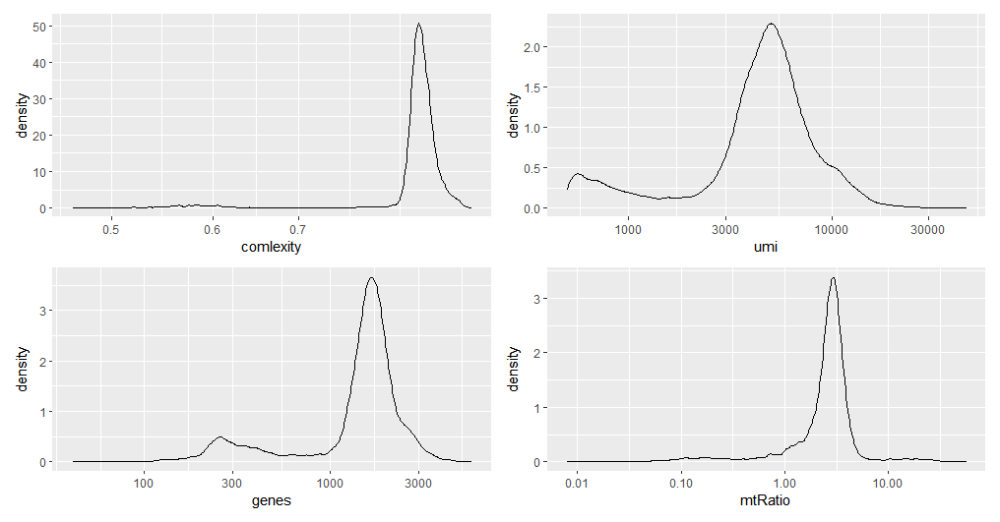
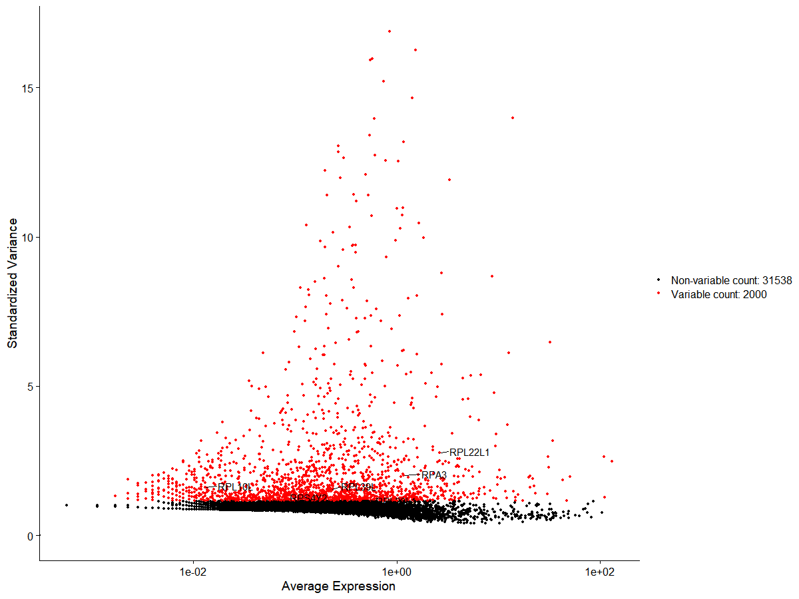
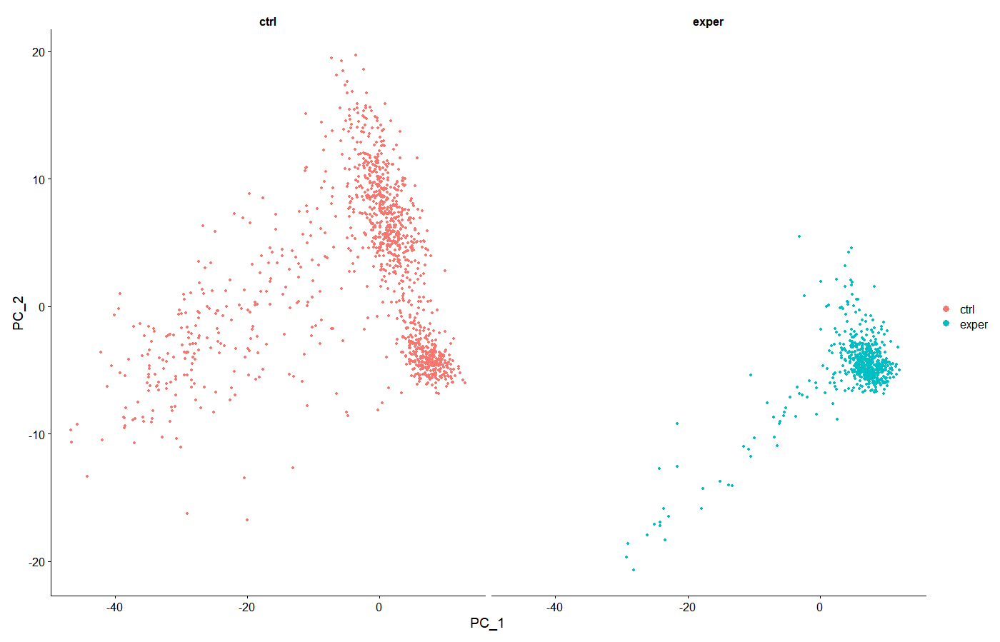
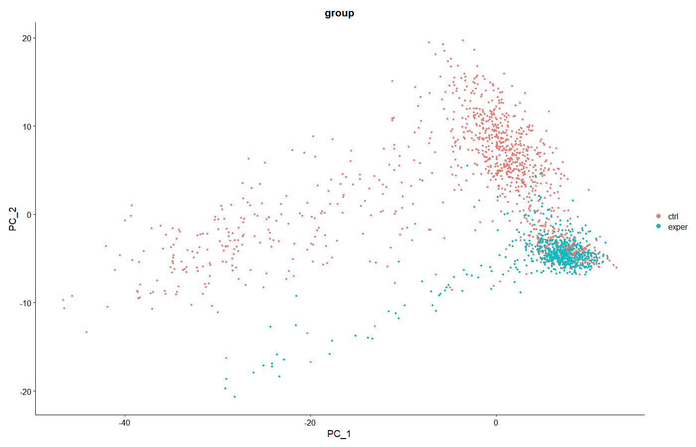
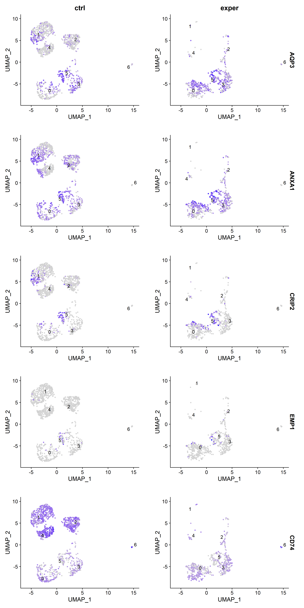
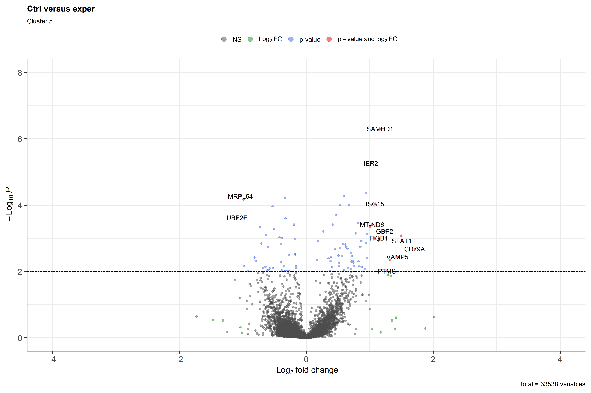
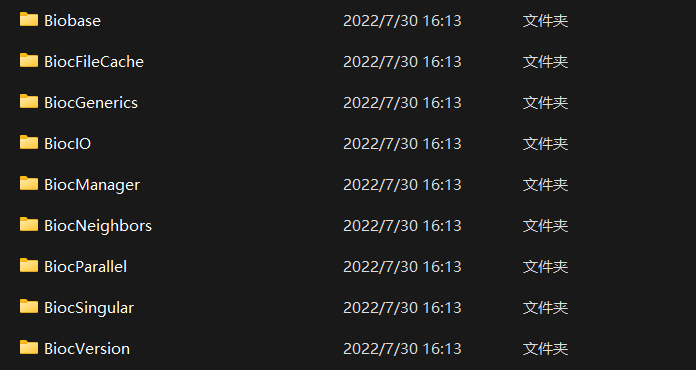

# 

# 单细胞测序 (scRNA-seq) 数据分析


本文介绍使用R语言对单细胞测序数据进行分析的一般步骤

本文使用的样例数据在此下载

[原始测序数据](../../file/scRNAseq/source_data)


## 前置条件

- 一定的R语言基础（数据类型与数据结构，包的安装与使用，Bioconductor包管理器的使用，ggplot2包的使用）
- 具有充足的内存（对于较大数据可能需要8GB以上）
- 安装了以下包（部分包可能不是运行本文代码必须的，但在处理数据中较为常用，因此仍推荐安装）：
  
   'Seurat', 'dplyr', 'mindr', 'tidyverse', 'patchwork', 'SeuratObject', 'SingleR', 'GenomeInfoDb', 'scater', 'loomR', 'monocle', 'SummarizedExperiment', 'Matrix', 'BiocManager', 'ggplot2',  'ggrastr', 'pheatmap', 'S4Vectors', 'IRanges', 'EnhancedVolcano'
  
  可以在开始时使用以下代码，对所需的包进行批量安装并加载：
  
  ```R
  PackageForSingleCellSeq<-function( ){
    pnames<-c(
      'Seurat', 'dplyr', 'mindr', 'tidyverse', 'patchwork',
      'SeuratObject', 'SingleR', 'GenomeInfoDb', 'scater', 'loomR', 'monocle',
      'SummarizedExperiment', 'Matrix', 'ggplot2', 'ggrastr', 
      'BiocManager', 'S4Vectors', 'IRanges', 'EnhancedVolcano',
      NULL
    )
    #使用自带的包管理器尝试进行安装
    i<-1
    while(i<=length(pnames))
    {
      if(!requireNamespace(pnames[i],quietly=TRUE))
        {
          install.packages(pnames[i])
          cat(c("\n","install:",pnames[i],"\n"))
      }
      library(pnames[i],character.only=TRUE)
      cat(c("\n","load:",pnames[i],"\n"))
      i<-i+1
    }
    #使用Bioconductor管理器尝试进行安装  
    i<-1
    while(i<=length(pnames))
    {
      if(!requireNamespace(pnames[i],quietly=TRUE))
      {
        BiocManager::install(pnames[i])
        cat(c("\n","install:",pnames[i],"\n"))
      }
      library(pnames[i],character.only=TRUE)
      cat(c("\n","load:",pnames[i],"\n"))
      i<-i+1
    }
  	cat("\n\nPackageForSingleCellSeq Done\n\n")
  }
  
  PackageForSingleCellSeq( )
  ```
  本文中使用R版本为4.1.2，且使用RStudio作为GUI
  
##Step 1 - 数据读取、质控与聚类分析
### 原始数据准备与读取

以下内容均在成功加载所需包后方可正常运行
首先设置工作环境

```R
rm(list=ls()) #清除环境中已有变量
setwd("U:/SingleCellSeq/demo") #设置工作目录，根据实际位置自行设置。对于Windows，需要将反斜杠\更改为斜杠/
dir.create(paste(getwd(),"/R_data",sep='')) #在工作目录中创建新目录R_data，用于储存数据
dir.create(paste(getwd(),"/pictures",sep=''))#在工作目录中创建新目录pictures，用于储存图片
```
之后载入原始测序数据。通用的scRNAseq数据中，每个样本应包括三个文件：

- `barcodes.tsv.gz`
- `features.tsv.gz`
- `matrix.mtx.gz`

这三个文件<b style="color:red;">文件名均为固定，不可修改</b>；相同样本的三个文件同处于一个文件夹目录下，可利用文件夹名区分样本名。

在R中需要读取该样本数据时，只需要指定三个文件所在的文件夹位置，即可使用Seurat包自动读取并分析

本文中，共两个样本（分别命名为ctrl和exper），存储在工作目录下的`source`目录内。即文件结构为：
```
（工作目录）
│
└─source
    ├─ctrl
    │      barcodes.tsv.gz
    │      features.tsv.gz
    │      matrix.mtx.gz
    │
    └─exper
            barcodes.tsv.gz
            features.tsv.gz
            matrix.mtx.gz
```
分别读取ctrl、exper组的原始数据，并创建对应的Seurat对象
```R
URLctrl<-'./source/ctrl/' #ctrl组的源数据位置
URLexper<-'./source/exper/' #exper组的源数据位置

#读取原始数据
ctrl.counts<-Read10X(URLctrl)
exper.counts<-Read10X(URLexper)

#将原始数据转换为Seurat对象
#函数用法：CreateSeuratObject(counts = 原始数据, project = "样本名（可随意制定）")
ctrl <- CreateSeuratObject(counts = ctrl.counts, project = "ctrl")
exper <- CreateSeuratObject(counts = exper.counts, project = "exper")
#此时可直接剔除存在于小于min.cells数的基因与含有基因（features）数小于min.features的细胞
#如
#exper <- CreateSeuratObject(counts = exper.counts, project = "exper",min.cells = 3,min.features =200)

#由于原始数据已经成功用来创建了Seurat对象，因此可以将存储原始数据的变量删除以释放内存
rm(ctrl.counts)
rm(exper.counts)
```
### 质控指标计算

成功创建Seurat对象后，可以根据自身需要，计算指定的统计指标并附加存储与Seurat对象中，为后续质控环节做准备

使用`$`符号，即可在对象（本质为列表）内追加新的元素（即存储一个新的指标）

常见需要关注的指标有：

- nFeature_RNA：每个细胞中检测到的基因种类数
  - 低质量的细胞或空的droplet液滴通常含有很少的基因
  - Cell doubles 或 multiplets可能表现出异常高的基因计数
- nCount_RNA：每个细胞中检测到的总分子数，即UMIs（Unique Molecule Identifiers）
  - 过低/过高可能代表细胞不完整、质量低或单个液滴包含多个细胞
- percent.mt：线粒体基因含量比例
  - 高线粒体基因比例：低质量或者死亡细胞
  - 低线粒体基因比例：细胞碎片或特殊类型细胞

```R
#在列表中添加指标：线粒体DNA的量
#如小鼠中，线粒体基因名称中含有表达式"^mt-"，因此可以快速寻找出线粒体基因（人中线粒体基因为"^MT-"）
ctrl$mtRatio<-PercentageFeatureSet(ctrl, pattern = "^mt-")
exper$mtRatio<-PercentageFeatureSet(exper, pattern = "^mt-")

#在列表中添加指标：基因复杂度（log10(feature)/log10(count)）
#反映测序深度（每个基因平均被测得的分子数）：复杂度越高，测序深度越低
ctrl$comlexity<-log10(ctrl$nFeature_RNA)/log10(ctrl$nCount_RNA)
exper$comlexity<-log10(exper$nFeature_RNA)/log10(exper$nCount_RNA)

#方便查看，将@meta.data单独提取并展示
ctrl_meta<-ctrl@meta.data
exper_meta<-exper@meta.data

#可以修改提取出的元数据
#Rename col:（使用dplyr::rename工具,新名字=旧名字）
ctrl_meta<-ctrl_meta %>%
  dplyr::rename(
    genes=nFeature_RNA,
    umi=nCount_RNA,
    group=orig.ident
  )

exper_meta<-exper_meta %>%
  dplyr::rename(
    genes=nFeature_RNA,
    umi=nCount_RNA,
    group=orig.ident
  )

#也可直接将提取出&修改过的meta.data赋值回原数据
ctrl@meta.data<-ctrl_meta
exper@meta.data<-exper_meta

#时常保存对象！
save(ctrl, file=paste(getwd(),"./R_data/ctrl_seurat.RData",sep=''))
save(exper, file=paste(getwd(),"./R_data/exper_seurat.RData",sep=''))
````
### 进行数据质控：剔除质量较低的细胞

```R
#查看数据质量
#小提琴图
VlnPlot(ctrl, features = c("genes", "umi", "mtRatio"), ncol = 3)
VlnPlot(exper, features = c("genes", "umi", "mtRatio"), ncol = 3)
```
绘制出的小提琴图如图所示


```R
#密度分布图(x=umi/genes/complexity etc)
###绘制ctrl中质控指标
pcom<-ctrl@meta.data %>%
  ggplot(aes(x=comlexity)) +
  geom_density(alpha = 0.2) +
  scale_x_log10()

pumi<-ctrl@meta.data %>%
  ggplot(aes(x=umi)) +
  geom_density(alpha = 0.2) +
  scale_x_log10()

pf<-ctrl@meta.data %>%
  ggplot(aes(x=genes)) +
  geom_density(alpha = 0.2) +
  scale_x_log10()

pmt<-ctrl@meta.data %>%
  ggplot(aes(x=mtRatio)) +
  geom_density(alpha = 0.2) +
  scale_x_log10()

pcom+pumi+pf+pmt#同时绘制四张图
```
密度分布图如图所示



```R
###绘制exper中质控指标
pcom<-exper@meta.data %>%
  ggplot(aes(x=comlexity)) +
  geom_density(alpha = 0.2) +
  scale_x_log10()

pumi<-exper@meta.data %>%
  ggplot(aes(x=umi)) +
  geom_density(alpha = 0.2) +
  scale_x_log10()

pf<-exper@meta.data %>%
  ggplot(aes(x=genes)) +
  geom_density(alpha = 0.2) +
  scale_x_log10()

pmt<-exper@meta.data %>%
  ggplot(aes(x=mtRatio)) +
  geom_density(alpha = 0.2) +
  scale_x_log10()

pcom+pumi+pf+pmt
```
```R
#仅保留umi>2000
#筛选/剔除：使用subset()函数，提取符合条件的对象
#subset(x=数据,subset=条件)
ctrl<-subset(
  x=ctrl,
  subset=(umi>2000)
)


#可以使用merge来合并两个seurat对象
#merge(对象1,y=c(对象2,对象3,...),add.cell.ids=c(,,),project="")
mergedata<-merge(ctrl,y=exper,add.cell.ids=c("ctrl","exper"),project="Homo_sapiens_merged")

#这里展示对合并后数据进行筛选
mergedata_filtered<-subset(
  x=mergedata,
  subset=(umi>2000)&(genes>1000)&(mtRatio<10)
)

#绘制剔除后的分布图；两组同时绘制
VlnPlot(mergedata_filtered, features = c("genes", "umi", "mtRatio"), ncol = 3)
```
```R
##以下步在CreateSeuratObject声明中即可完成，不推荐此方法！
# #保留只在10个以上细胞中表达的基因 
# genecounts<-GetAssayData(object =mergedata_filtered, slot = "counts")
# isexpress<-(genecounts>0) #生成逻辑向量，不表达为0
# # 将所有TRUE值相加，如果每个基因的TRUE值超过10个，则返回TRUE。
# isexpressover <- (Matrix::rowSums(isexpress) >= 10)
# # 仅保留那些在10个以上细胞中表达的基因
# genecounts_filtered <- genecounts[isexpressover, ]
# # 重新赋值给经过过滤的Seurat对象
# mergedata_filtered <- CreateSeuratObject(counts=genecounts_filtered,project = "mergedata")

save(mergedata_filtered, file=paste(getwd(),"/R_data/mergedata_filtered_seurat.RData",sep=''))
```
### 基因表达初步分析

绘制每个样本中的基因表达图，寻找组内高变的基因

```R
#标准化
mergedata_norm<-NormalizeData(mergedata_filtered,normalization.method = "LogNormalize",scale.factor = 10000)

#feature selection 选取高变基因
#使用 FindVariableFeatures函数的vst方法，nfeatures=待选取的高变基因个数
mergedata_var <- FindVariableFeatures(mergedata_norm, selection.method = "vst", nfeatures = 2000)

#高变基因的质控小提琴图
#VlnPlot(mergedata_var,features = c('genes','umi'))

#利用subset提取出所有ctrl/exper数据
ctrl_var<-subset(x=mergedata_var,subset=(group=="ctrl"))
exper_var<-subset(x=mergedata_var,subset=(group=="exper"))
# Identify the 10 most highly variable genes,使用head()与VariableFeatures()函数
ctrl_top <- head(VariableFeatures(ctrl_var), 10)
exper_top<-head(VariableFeatures(exper_var), 10)

#绘制ctrl所有高变基因VariableFeaturePlot()
ploti1=VariableFeaturePlot(ctrl_var)
#并将其中前10进行标注LabelPoints()
plot1=LabelPoints(plot = ploti1, points = ctrl_top, repel = TRUE)

#绘制exper所有高变基因VariableFeaturePlot()
ploti2=VariableFeaturePlot(exper_var)
#并将其中前10进行标注LabelPoints()
plot2=LabelPoints(plot = ploti2, points = exper_top, repel = TRUE)

plot1+plot2#同时绘制两张图
```
基因表达图如图所示


```R
#以ctrl组为例，显示核糖体基因名称，使用grepl函数提取含有关键字的元素列表并返回BOOL向量，ignore大小写
rbgenes<-rownames(ctrl_var)[grepl('^RP',rownames(ctrl_var),ignore.case = TRUE)]
#仅保留所有核糖体基因
ctrl_RB<-ctrl_var[rbgenes, ]
#在总基因分布图中标注前十的核糖体基因
plot_RB<-LabelPoints(plot = ploti1, points = head(VariableFeatures(ctrl_rb),10), repel = TRUE)
plot_RB
```


### 细胞PCA降维与聚类

```R
##数据降维
#中心化
mergedata_scaled<-ScaleData(mergedata_var)

#PCA分析
mergedata_PCA<-RunPCA(object = mergedata_scaled)

#查看主成分比例分布，便于确定主成分数量
ElbowPlot(mergedata_PCA)
```


```R
PCA<-8 #选取至不再下降为为止
#绘制PC分类图，使用split.by，不同标签（ctrl/exper）分别绘制
PCAPlot(mergedata_PCA,split.by="group")
```
使用split.by，不同标签（ctrl/exper）分别绘制



```R
#绘制PC分类图，使用group.by，不同标签（ctrl+exper）同时绘制
PCAPlot(mergedata_PCA,group.by="group")
```
使用group.by，不同标签（ctrl+exper）同时绘制，可以对比两个样本分布差异



```R
#细胞分类，即采用FindNeighbors()与FindClusters()
#选择不同的resolution值可以获得不同的cluster数目，值越大cluster数目越多，默认值是0.5.
mergedata_neighbors <- FindNeighbors(mergedata_PCA, dims = 1:PCA)
mergedata_clusters <- FindClusters(mergedata_neighbors, resolution = 0.5)

##可视化分类结果,TSNE与UMAP均为在原始seurat对象中追加成分，故无需新建对象
#RunTSNE/RunUMAP的seurat对象中必须包含PCA，即已运行过RunPCA。
#方法一：TSNE
mergedata_clusters<-RunTSNE(mergedata_clusters,dims=1:PCA,label=T)
#不同标签（ctrl/exper）分别绘制
tplot=TSNEPlot(mergedata_clusters,split.by="group",label=T,repel=T)
#使用png()函数，可以将图片以PNG格式保存。需要与dev.off()配对使用
png(paste(getwd(),"/pictures/","TSNE_labeled.png",sep=''), height=6000,width=9000, res=850)
tplot
dev.off()

#不同标签（ctrl+exper）同时绘制
tplot=TSNEPlot(mergedata_clusters,split.by="group",label=F)
png(paste(getwd(),"/pictures/","TSNE.png",sep=''), height=6000,width=9000, res=850)
tplot
dev.off()
```
TSNE聚类结果，不同标签（ctrl/exper）分别绘制


TSNE聚类结果，不同标签（ctrl+exper）同时绘制


```R
#方法二：UMAP
mergedata_clusters<-RunUMAP(mergedata_clusters,dims=1:PCA,label=T)
#图中添加标签，repel可防止标签与图像点重合
uplot=UMAPPlot(mergedata_clusters,split.by="group",label=T,repel=T)
png(paste(getwd(),"/pictures/","UMAP_labeled.png",sep=''), height=6000,width=9000, res=850)
uplot
dev.off()
#图中不添加标签
uplot=UMAPPlot(mergedata_clusters,split.by="group",label=F)
png(paste(getwd(),"/pictures/","UMAP.png",sep=''), height=6000,width=9000, res=850)
uplot
dev.off()
save(mergedata_clusters, file=paste(getwd(),"/R_data/mergedata_UMAP_TSNE_seurat.RData",sep=''))
```
UMAP聚类结果，图中添加标签


##Step 2 - 细胞类型注释

上述的聚类结果仅是将细胞分为不同的Cluster，但未能给出每个Cluster的细胞类型。因此，需要利用合适的参考数据集，对聚类结果进行注释，从而完成对细胞类型的辨认。

参考数据集可以通过数据库/原文献自行获取，参考数据集的质量与合适与否直接关系到注释结果。

这里使用人类全细胞全基因组的参考集`ref_Human_all.RData`，其格式为`.RData`，可以直接载入进R供后续使用。

下面压缩包内提供了若干参考集：

[参考集数据](../../file/scRNAseq/SingleR_ref)（分卷压缩，全部下载后置于同一目录；解压第一个压缩包即可）

本例中，参考基因组存放于工作目录下的`SingleR_ref`目录中。

```R
#设置工作目录
setwd("U:/SingleCellSeq/demo")
rm(list=ls())
load("R_data/mergedata_UMAP_TSNE_seurat.RData")#载入上一步完成聚类的Seurat对象

data_for_SingleR <- GetAssayData(mergedata_clusters, slot="data")
##slot="data"得到Normalized data matrix：row代表基因名，col代表细胞编号.data表示@assays[["RNA"]]@data@x，标准化后的表达量
##slot="counts"得到count值，行列含义与上述相同

clusters<-mergedata_clusters@meta.data$seurat_clusters

#载入reference
load(paste(getwd(),"/SingleR_ref/ref_Human_all.RData",sep=''))#ref_Human
#载入后变量列表出现新变量"ref_Human_all"

#使用参考数据注释后的数据
mergedata_SingleR_with_All<-SingleR(test = data_for_SingleR, ref = ref_Human_all, labels =ref_Human_all@colData@listData[["label.main"]])
save(mergedata_SingleR_with_All,file=paste(getwd(),"/R_data/mergedata_SingleR_with_ref_Human_all.RData",sep=''))

#可视化
celltype = data.frame(ClusterID=rownames(mergedata_SingleR_with_All), celltype=mergedata_SingleR_with_All$labels, stringsAsFactors = F)
#如下为sce对象注释细胞cluster鉴定结果
mergedata_types<-mergedata_clusters
mergedata_types@meta.data$mergedata_SingleR_with_All <- 'NA'
#先新增列celltype，值均为NA，然后利用下一行代码循环填充
for(i in 1:nrow(celltype)){
  mergedata_types@meta.data[which(rownames(mergedata_types@meta.data)== celltype$ClusterID[i]),'celltype_by_ref_Human_all'] <- celltype$celltype[i]
}

png(paste(getwd(),"/pictures/","types_UMAP_ref_HUMAN.png",sep=''), height=10000,width=10000, res=850)
UMAPPlot(mergedata_types,split.by="group",group.by="celltype_by_ref_Human_all",label=T,repel=T)
dev.off()
png(paste(getwd(),"/pictures/","type_TSNE_ref_HUMAN.png",sep=''), height=10000,width=10000, res=850)
TSNEPlot(mergedata_types,split.by="group",group.by="celltype_by_ref_Human_all",label=T,repel=T)
dev.off()
save(mergedata_clusters, file=paste(getwd(),"/R_data/mergedata_types_seurat.RData",sep=''))
```

TSNE聚类+注释


UMAP聚类+注释


可以看出，用该参考集注释后，很多类型的细胞被划分为同一类“T cell”，这说明该参考集的分辨率较低。对于该情况，则可以考虑使用例如专用于免疫细胞注释/T细胞注释的参考集，以将此类细胞类型区分开来。

##Step 3 - 基因表达分析

```R
rm(list=ls())#设置工作目录
setwd("U:/SingleCellSeq/demo")
load("R_data/mergedata_UMAP_TSNE_seurat.RData")


#寻找每个cluster的高变代表基因，并选取前5个，进行可视化
p<-list()
topmarkers<-list()
for( i in unique(mergedata_clusters@meta.data$seurat_clusters) )#unique()返回所有元素类型组成的列表，即(0,1,2,3,4,5,6)
{
  markers_df <- FindMarkers(object = mergedata_clusters,ident.1=i,min.pct = 0.1) #ident.1即为聚类图中的亚群;返回排序后的dataframe
  print(x = head(markers_df))
  markers_genes =  rownames(head(x = markers_df, n = 5))
  p1 <- VlnPlot(object = mergedata_clusters, features =markers_genes,log =T,ncol = 2,split.by = "group")#每个cluster的高变基因在各个cluster中的表达分布
  p[[i]][[1]] <- p1
  p2 <- FeaturePlot(object = mergedata_clusters, features=markers_genes,ncol = 2,split.by = "group",pt.size=1,label=T,repel=T)#每个cluster的高变基因在聚类图中的表达特征图
  p[[i]][[2]] <- p2
  topmarkers[[i]]<-markers_df
}

#将图片保存为PNG格式于工作目录下
#每个cluster的高变基因在各个cluster中的表达分布
i<-1
while( i <=length(p))
{
  png(paste(getwd(),"/pictures/","vln_cluster",i-1,".png",sep=''), height=3000,width=5000, res=300)
  p[[i]][[1]]
  print(p[[i]][[1]])
  dev.off()
  Sys.sleep(10)
  i<-i+1
}
```
以Cluster0为例，效果如图：


```R
#每个cluster的高变基因在聚类图中的表达特征图
i<-1
while( i <=length(p))
{
  png(paste(getwd(),"/pictures/","feature_cluster",i-1,".png",sep=''), height=6000,width=3000, res=300)
  p[[i]][[2]]
  print(p[[i]][[2]])
  dev.off()
  Sys.sleep(30)
  i<-i+1
}
```
以Cluster0为例，效果如图：



```R
save(topmarkers,file=(paste(getwd(),"/R_data/topmarkers.Rdata",sep='')))
save(p,file=(paste(getwd(),"/R_data/markerspictures.Rdata",sep='')))

#查阅所有的marker基因，返回值根据 p_val由小到大排序
allmarkers<- FindAllMarkers(object = mergedata_clusters,  min.pct = 0.1)

#(自定义排序）
allmarkers_order<-allmarkers[order(allmarkers$avg_log2FC),]
head(allmarkers_order,10) #查看排名前十的基因信息
```
```R
##热图可视化每个cluster的marker基因表达差异
#分组选取前十marker
top10 <- allmarkers %>% group_by(cluster) %>% slice_max(avg_log2FC,n=10)
save(top10,file=(paste(getwd(),"/R_data/top10markersofall.Rdata",sep='')))
##上一句中，group_by通过管道函数作用于slice_max，即先根据cluster分为各组，再依据avg_log2FC分别选取每一组的前10（即一共有组数*n个结果）
#group_by处理后的数据不能直接展示处理效果（分组的效果是“隐藏”的），但用于后续计算时自动按组分别进行。可用于分组排序、分组计算平均/中位数等
#slice_max(data.frame,参照列的名称,n=n) 即按照指定列选出前n行，并对结果进行排序。slice_min同理

png(paste(getwd(),"/pictures/","HeatMap.png",sep=''), height=10000,width=10000, res=850)
DoHeatmap(mergedata_clusters,features=top10$gene,label=F)
dev.off()
```


```R
#点图
top3 <- allmarkers %>% group_by(cluster) %>% slice_max(avg_log2FC,n=3)
png(paste(getwd(),"/pictures/","DotMap.png",sep=''), height=10000,width=10000, res=850)
DotPlot(mergedata_clusters,features=top3$gene,cols=c('red','yellow','green','blue'))
dev.off()
```


## Step4 - 组间基因表达差异分析——火山图

先前的高变基因，仅是进行了组内分析；在很多时候，我们需要对比实验组（exper）和对照组（ctrl）之间，有哪些细胞类型中的哪些基因的表达受到了显著影响，因此需要进行组间基因表达差异分析，即绘制“火山图”

该部分数据保存于工作目录下的`DESeq2`目录下

```R
###############################################
#组间差异分析（火山图）-DESeq2包
###############################################

###对照组/实验组的差异基因按照细胞类型分别分析
rm(list=ls())#设置工作目录
setwd("U:/R/R_advanced/SingleCellSeq/demo")
load("R_data/mergedata_types_seurat.RData")#载入注释后的Seurat对象
dir.create("R_data/DESeq2")

clusterSeurat<-list()
cluster<-levels(mergedata_clusters@meta.data[["seurat_clusters"]])
save(cluster,file="R_data/DESeq2/cluster.RData")

for( i in cluster)
{
  ids<-(mergedata_clusters@meta.data[["seurat_clusters"]] == i)
  clusterSeurat[i]<- mergedata_clusters[ ,ids]
}

clusterCounts<-list()

for( i in cluster)
{
  temp<-as.matrix(clusterSeurat[[i]]@assays[["RNA"]]@counts)
  clusterCounts[[i]]<-temp
}

clusterColData<-list()

for( i in cluster)
{
  condition<-clusterSeurat[[i]]@meta.data[["group"]]
  clusterColData[[i]]<-data.frame(row.names=colnames(clusterCounts[[i]]),condition,stringsAsFactors = T)
  rownames(clusterColData[[i]])<-colnames(clusterCounts[[i]])
  colnames(clusterColData[[i]])<-'condition'
}

clusterDDS_temp<-list()

for( i in cluster)
{
  clusterDDS_temp[[i]]<-DESeqDataSetFromMatrix(countData = clusterCounts[[i]],colData = clusterColData[[i]],design = ~condition)
}

save(clusterDDS_temp,file="R_data/DESeq2/clusterDDS_temp.RData")

clusterDDS<-list()

library("DESeq2")#载入包

for( i in cluster)
{
  clusterDDS[[i]]<-DESeq(clusterDDS_temp[[i]])
  cat("\nprocess down\n",i,"\n")
}

save(clusterDDS,file="R_data/DESeq2/clusterDDS.RData")

res<-list()
for( i in cluster)
{
  temp <- DESeq2::results(clusterDDS[[i]], contrast=c("condition", "ctrl", "exper")) 
  #注意此处contrast的顺序，为contrast=c("条件（组别）", "分子组", "分母组")
  #在进行log2FC计算时，为log2("分子组"表达量/"分母组"表达量)。请根据需要，合理安排"分子组"和"分母组"所对应的样本
  res[[i]] <- temp[order(temp$pvalue),]
  cat("\nprocess down\n",i,"\n")
}
save(res,file="R_data/DESeq2/clusterResults.RData")

clusterlog2FC<-list()
for( i in cluster)
{
  clusterlog2FC[[i]]<-data.frame(row.names=rownames(res[[i]]),log2FC=res[[i]][ ,"log2FoldChange"],pvalue=res[[i]][ ,"pvalue"])
}

library(EnhancedVolcano)#载入包
#分别绘制并保存每一个Cluster的火山图
clusterVolcano<-list()
for( i in cluster)
{
  clusterVolcano[[i]]<-EnhancedVolcano(clusterlog2FC[[i]],
                        lab = rownames(clusterlog2FC[[i]]),
                        x = 'log2FC',
                        y = 'pvalue',
                        xlim = c(-4, 4),
                        ylim=c(0,8),
                        title ='ctrl versus exper',
                        subtitle=paste("Cluster ",i,sep=''),
                        pCutoff = 10e-3,
                        FCcutoff = 1,
                        pointSize = 2.0,
                        labSize = 5.0)
  png(paste(getwd(),"/pictures/","volcano_cluster_",i,".png",sep=''), height=3000,width=4500, res=250)
  print(clusterVolcano[[i]])
  dev.off()
}

save(clusterVolcano,file="R_data/DESeq2/clusterVolcanoPlot.RData")
```

以Cluster 0为例，火山图结果为


以Cluster 5为例，火山图结果为



从而可以看出在每一细胞类型之中，对照组vs实验组，哪些基因被上/下调

（标准火山图中，左侧代表下调，右侧代表上调；上侧代表高显著度，即更大的P值。因此，认为左上区域基因发生显著下调，右上区域基因发生显著上调）

<b style="color:red;">注意：计算log2FC时的分子/分母何者对应于实验组/对照组，需要在代码中进行分析时进行指定。具体请参照代码内注释，并建议查看DESeq2::results函数的帮助说明！</b>

# 番外篇：获取无法下载的包

所需要的包无法正常下载安装是一件很令人头疼的事。尽管Bioconductor包解决了大多数在生物领域依赖包的下载问题，但少数包由于网络限制等原因难以下载

对于该种情况，常用的解决方法包括但不限于：更改下载源、获取程序包的源码并解压至对应目录

对于本文而言，还有一种更为简单的方法，即<b style="color:red;">抄作业！</b>——


下面的下载地址将许多常用的R包（包括本文所需的）整合在一个压缩文件中。从理论上，可以其解压后，将所有文件/文件夹移动至用于存储R包的目录

[下载链接](../../file/scRNAseq/library)（分卷压缩，全部下载后置于同一目录；解压第一个压缩包即可）

找到电脑中R的安装目录（如`R-1.4.2`）（例如你的`R.exe`，`Rgui.exe`程序就位于目录`R-1.4.2/bin`或`R-1.4.2/bin/x64`中）

R中所有下载安装的程序包都储存在此目录下的`library`目录中。其中每个文件夹的名字就代表着对应的一个包。

`R-1.4.2/library`中内容如图：



因此就可以实现这些包在不同机器之间的转移——

将上面压缩包中的包解压至`library`目录（若有重复，可根据版本自行取舍）即可。

（注：部分包版本较旧，可能需要更新。若使用中因为依赖包版本低而无法载入，可以使用BiocManager重新安装该依赖包）